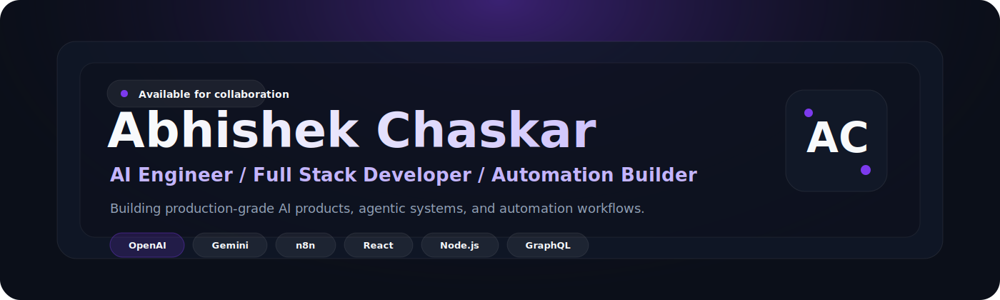
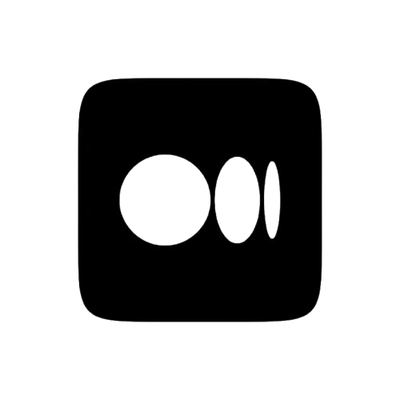
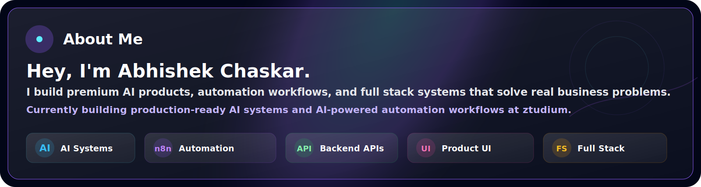
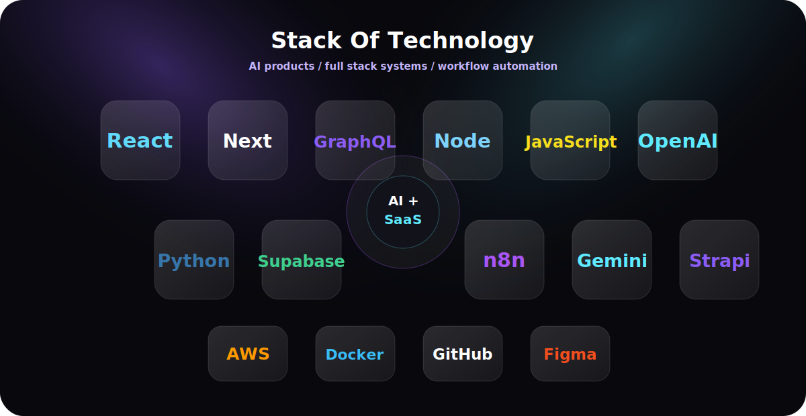
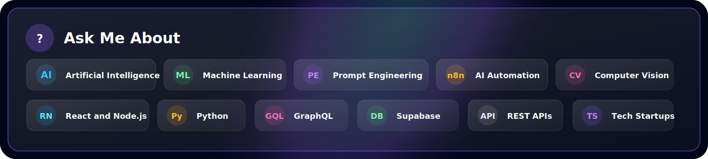
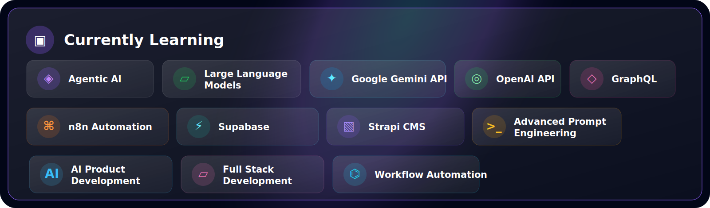
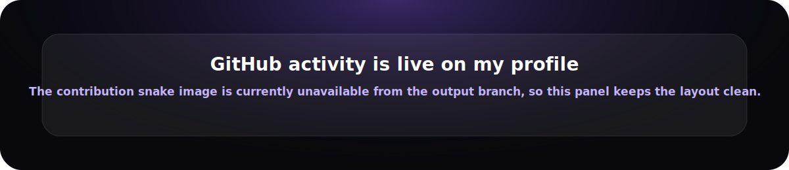

  

  
  &nbsp;&nbsp;
  
  &nbsp;&nbsp;
  
  &nbsp;&nbsp;
  
  &nbsp;&nbsp;
  
  &nbsp;&nbsp;
  

  

## About

  

> I like building software that feels premium, performs reliably, and solves real-world problems.

  

## Focus Areas

  

  

## Tech Stack

  

  

## Ask Me About

  

  

## Projects Worth Highlighting

  

  <a href="#"><b>Agentic AI Assistant</b></a>
  &nbsp;|&nbsp;
  <a href="#"><b>AI Automation Workflow System</b></a>
  &nbsp;|&nbsp;
  <a href="#"><b>HerbTech</b></a>
  &nbsp;|&nbsp;
  <a href="#"><b>Abhishek Apparels Digital Platform</b></a>
  &nbsp;|&nbsp;
  <a href="#"><b>Portfolio / Personal Website</b></a>

  

## Currently Learning

  

  

## GitHub Analytics

  <picture>
    <source media="(prefers-color-scheme: dark)" srcset="https://github-profile-summary-cards.vercel.app/api/cards/stats?username=Abhi-2812&amp;theme=github_dark" />
    <source media="(prefers-color-scheme: light)" srcset="https://github-profile-summary-cards.vercel.app/api/cards/stats?username=Abhi-2812&amp;theme=github" />
    
  </picture>
  <picture>
    <source media="(prefers-color-scheme: dark)" srcset="https://streak-stats.demolab.com?user=Abhi-2812&amp;hide_border=true&amp;background=08080D&amp;ring=8B5CF6&amp;fire=A855F7&amp;currStreakLabel=5EEBFF&amp;currStreakNum=E9D5FF&amp;sideNums=E9D5FF&amp;sideLabels=C4B5FD&amp;dates=A78BFA" />
    <source media="(prefers-color-scheme: light)" srcset="https://streak-stats.demolab.com?user=Abhi-2812&amp;hide_border=true&amp;background=F8FAFC&amp;ring=6D28D9&amp;fire=A855F7&amp;currStreakLabel=0891B2&amp;currStreakNum=111827&amp;sideNums=111827&amp;sideLabels=334155&amp;dates=64748B" />
    
  </picture>

  <picture>
    <source media="(prefers-color-scheme: dark)" srcset="https://github-readme-stats.vercel.app/api/top-langs/?username=Abhi-2812&amp;layout=compact&amp;hide_border=true&amp;bg_color=08080D&amp;title_color=C4B5FD&amp;text_color=E9D5FF" />
    <source media="(prefers-color-scheme: light)" srcset="https://github-readme-stats.vercel.app/api/top-langs/?username=Abhi-2812&amp;layout=compact&amp;hide_border=true&amp;bg_color=F8FAFC&amp;title_color=6D28D9&amp;text_color=334155" />
    
  </picture>

  

## Activity

  

  

  

  

  

