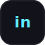
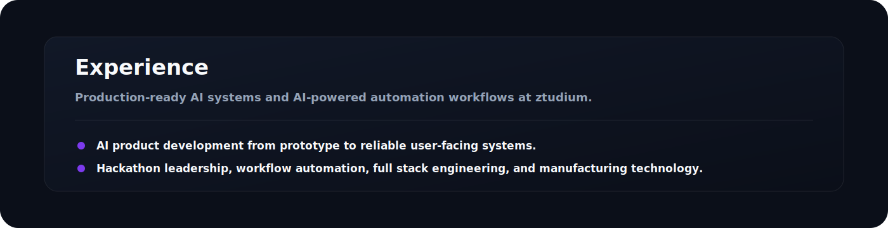

  

  
  &nbsp;
  
  &nbsp;
  
  &nbsp;
  

 

## About Me

  

## Current Focus

  

## Tech Stack

  

## Featured Projects

  

  <a href="#"><b>Agentic AI Assistant</b></a>
  &nbsp;•&nbsp;
  <a href="#"><b>AI Automation Workflow System</b></a>
  &nbsp;•&nbsp;
  <a href="#"><b>HerbTech</b></a>
  &nbsp;•&nbsp;
  <a href="#"><b>Abhishek Apparels Digital Platform</b></a>
  &nbsp;•&nbsp;
  <a href="#"><b>Portfolio / Personal Website</b></a>

## Experience

  

## GitHub Analytics

  
  

## Connect

  
  &nbsp;
  
  &nbsp;
  
  &nbsp;
  
  &nbsp;
  
  &nbsp;
  

  

