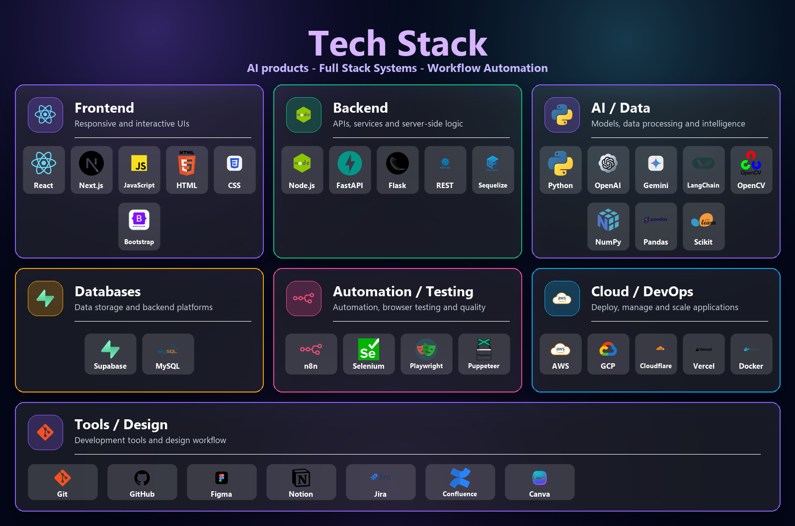
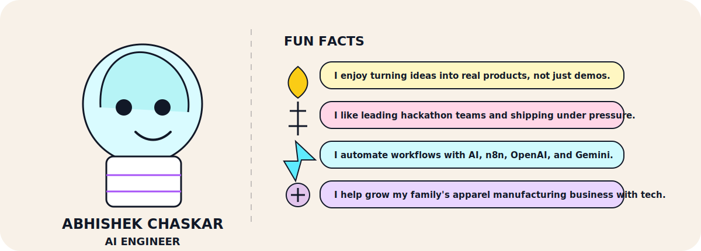

  

  
  &nbsp;&nbsp;
  
  &nbsp;&nbsp;
  
  &nbsp;&nbsp;
  
  &nbsp;&nbsp;
  
  &nbsp;&nbsp;
  

  

## About

  

> I like building software that feels premium, performs reliably, and solves real-world problems.

## Focus Areas

  

## Tech Stack

  

## Ask Me About

  

## Projects Worth Highlighting

  

  <a href="#"><b>Agentic AI Assistant</b></a>
  &nbsp;|&nbsp;
  <a href="#"><b>AI Automation Workflow System</b></a>
  &nbsp;|&nbsp;
  <a href="#"><b>HerbTech</b></a>
  &nbsp;|&nbsp;
  <a href="#"><b>Abhishek Apparels Digital Platform</b></a>
  &nbsp;|&nbsp;
  <a href="#"><b>Portfolio / Personal Website</b></a>

## Currently Learning

  

## GitHub Analytics

  
  

  

  

## Activity

  

  

## Fun Fact

  

  

