  

  <a href="https://linkedin.com/in/abhishek-sushant-chaskar-63748b219"><b>LinkedIn</b></a>
  &nbsp;|&nbsp;
  <a href="mailto:abhishek.chaskar.tkc@gmail.com"><b>Email</b></a>
  &nbsp;|&nbsp;
  <a href="https://medium.com/@abhishek.chaskar.tkc"><b>Medium</b></a>
  &nbsp;|&nbsp;
  <a href="https://instagram.com/abhi_c_2004"><b>Instagram</b></a>

  

## About

<table>
  <tr>
    <td width="58%" valign="top">
      <h3>Hey, I'm Abhishek Chaskar.</h3>
      

        I enjoy building products where <b>Artificial Intelligence</b>, <b>Automation</b>, and
        <b>Modern Engineering</b> come together to solve real business problems.
      

      

        Currently, I'm building <b>production-ready AI systems</b> and <b>AI-powered automation workflows</b>
        at <b>ztudium</b>, combining intelligent workflows, scalable architecture, and clean user experiences.
      

      

        <b>Core stack:</b> React, Node.js, GraphQL, Supabase, Strapi, OpenAI, Google Gemini, and n8n.
      

      <blockquote>
        I like building software that feels premium, performs reliably, and solves real-world problems.
      </blockquote>
    </td>
    <td width="42%" align="center" valign="top">
      
    </td>
  </tr>
</table>

## Focus Areas

<table>
  <tr>
    <td width="50%" valign="top">
      <h3>Agentic AI</h3>
      
Building systems that can plan, reason, use tools, and act across product workflows.

    </td>
    <td width="50%" valign="top">
      <h3>RAG & Knowledge Systems</h3>
      
Retrieval, context engineering, grounded answers, and practical LLM product behavior.

    </td>
  </tr>
  <tr>
    <td width="50%" valign="top">
      <h3>AI Product Development</h3>
      
Taking AI ideas from prototype to production with usable interfaces and reliable systems.

    </td>
    <td width="50%" valign="top">
      <h3>Workflow Automation</h3>
      
Saving time with smart pipelines, n8n automations, and AI-powered operating systems.

    </td>
  </tr>
</table>

## Tech Stack

<table>
  <tr>
    <td width="25%"><b>Frontend</b></td>
    <td>React, Next.js, JavaScript, HTML, CSS, Bootstrap, Framer Motion</td>
  </tr>
  <tr>
    <td><b>Backend</b></td>
    <td>Node.js, FastAPI, Flask, GraphQL, Sequelize, REST APIs</td>
  </tr>
  <tr>
    <td><b>AI / Data</b></td>
    <td>Python, Machine Learning, TensorFlow, PyTorch, scikit-learn, OpenCV, NumPy, Pandas, OpenAI, Google Gemini</td>
  </tr>
  <tr>
    <td><b>Databases / CMS</b></td>
    <td>Supabase, MySQL, Strapi CMS</td>
  </tr>
  <tr>
    <td><b>Automation / Testing</b></td>
    <td>n8n, Selenium, Playwright, Puppeteer, Prompt Engineering</td>
  </tr>
  <tr>
    <td><b>Cloud / DevOps</b></td>
    <td>AWS, Google Cloud, Cloudflare, Vercel, Render, Docker</td>
  </tr>
  <tr>
    <td><b>Tools / Design</b></td>
    <td>Git, GitHub, Figma, Notion, Canva, Jira, Confluence</td>
  </tr>
</table>

  

## Ask Me About

<table>
  <tr>
    <td>Artificial Intelligence</td>
    <td>Machine Learning</td>
    <td>Prompt Engineering</td>
    <td>AI Automation</td>
  </tr>
  <tr>
    <td>Computer Vision</td>
    <td>React and Node.js</td>
    <td>Python</td>
    <td>GraphQL</td>
  </tr>
  <tr>
    <td>Supabase</td>
    <td>REST APIs</td>
    <td>Hackathons</td>
    <td>Tech Startups</td>
  </tr>
</table>

## Projects Worth Highlighting

<table>
  <tr>
    <td width="50%" valign="top">
      <h3><a href="#">Agentic AI Assistant</a></h3>
      
Agentic AI project highlight retained from the original README.

    </td>
    <td width="50%" valign="top">
      <h3><a href="#">AI Automation Workflow System</a></h3>
      
AI automation workflow project highlight retained from the original README.

    </td>
  </tr>
  <tr>
    <td width="50%" valign="top">
      <h3><a href="#">HerbTech</a></h3>
      
Project highlight retained from the original profile README.

    </td>
    <td width="50%" valign="top">
      <h3><a href="#">Abhishek Apparels Digital Platform</a></h3>
      
Digital platform direction connected to apparel manufacturing and technology-led growth.

    </td>
  </tr>
  <tr>
    <td width="100%" valign="top" colspan="2">
      <h3><a href="#">Portfolio / Personal Website</a></h3>
      
Personal brand and portfolio experience for presenting engineering, AI, and product work.

    </td>
  </tr>
</table>

## Currently Learning

<table>
  <tr>
    <td>Agentic AI</td>
    <td>Large Language Models</td>
    <td>Google Gemini API</td>
    <td>OpenAI API</td>
  </tr>
  <tr>
    <td>GraphQL</td>
    <td>n8n Automation</td>
    <td>Supabase</td>
    <td>Strapi CMS</td>
  </tr>
  <tr>
    <td>Advanced Prompt Engineering</td>
    <td>AI Product Development</td>
    <td>Full Stack Development</td>
    <td>Workflow Automation</td>
  </tr>
</table>

## GitHub Analytics

  
  

  

  

## Activity

  

  

  

## Fun Fact

I enjoy turning ideas into real products, whether it is building AI applications, leading hackathon teams, automating workflows, or helping grow my family's apparel manufacturing business through technology.

## Connect

<table>
  <tr>
    <td><a href="https://linkedin.com/in/abhishek-sushant-chaskar-63748b219">LinkedIn</a></td>
    <td><a href="mailto:abhishek.chaskar.tkc@gmail.com">abhishek.chaskar.tkc@gmail.com</a></td>
    <td><a href="https://medium.com/@abhishek.chaskar.tkc">Medium</a></td>
  </tr>
  <tr>
    <td><a href="https://instagram.com/abhi_c_2004">Instagram</a></td>
    <td><a href="https://pinterest.com/abhishekchaskartkc">Pinterest</a></td>
    <td><a href="https://stackoverflow.com/users/32882847">Stack Overflow</a></td>
  </tr>
</table>

  

